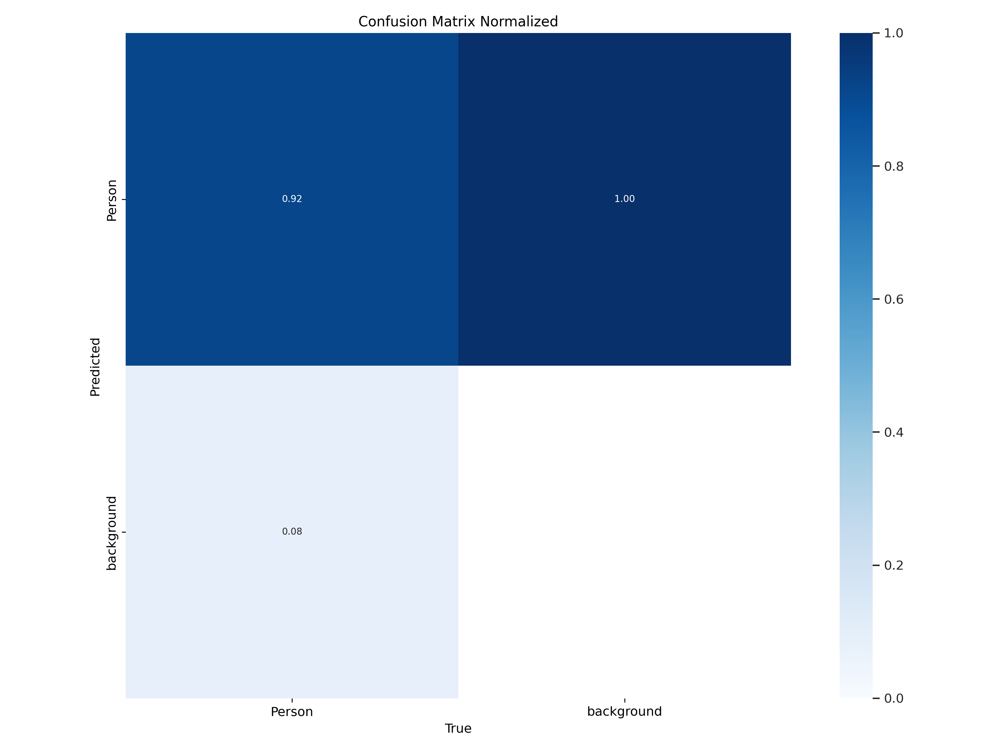
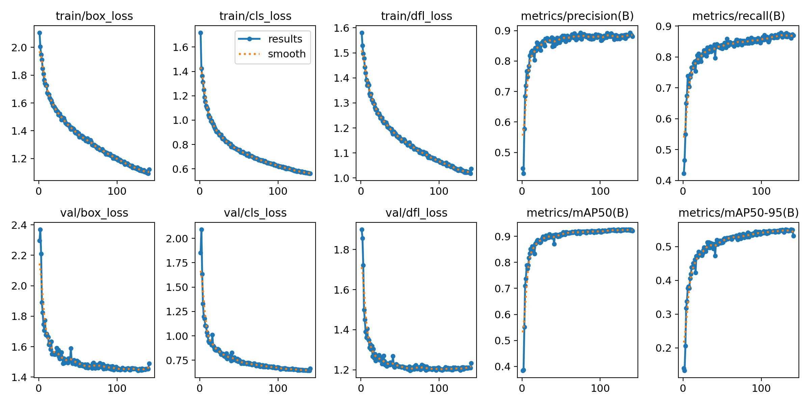

# Content : 
- [Content :](#content-)
- [What we do :](#what-we-do-)
  - [การ set ค่าอุณหภูมิต่างๆ](#การ-set-ค่าอุณหภูมิต่างๆ)
  - [รูปแบบการใช้โมเดลเพื่อสกัดข้อมูลมาใช้งาน](#รูปแบบการใช้โมเดลเพื่อสกัดข้อมูลมาใช้งาน)
    - [ข้อจำกัดของแต่ละ Library](#ข้อจำกัดของแต่ละ-library)
  - [Pipeline งาน](#pipeline-งาน)
- [Human Detection model](#human-detection-model)
  - [HumanDetect 2.0.1](#humandetect-201)
    - [2.0.1 DataSet](#201-dataset)
    - [2.0.1 Hyperparameter Tuning](#201-hyperparameter-tuning)
    - [2.0.1 Result](#201-result)
  - [HumanDetect 2.0.2](#humandetect-202)
    - [2.0.2 DataSet](#202-dataset)
    - [2.0.2 Hyperparameter Tuning](#202-hyperparameter-tuning)
    - [2.0.2 Result](#202-result)
- [Posture Detection model](#posture-detection-model)
  - [PostureDetect 1.0.1](#posturedetect-101)
    - [1.0.1 DataSet](#101-dataset)
    - [1.0.1 Hyperparameter Tuning](#101-hyperparameter-tuning)
    - [1.0.1 Result](#101-result)
  - [PostureDetect 1.0.2](#posturedetect-102)
  - [PostureDetect 1.0.3](#posturedetect-103)
    - [1.0.3 DataSet](#103-dataset)
    - [1.0.3 Hyperparameter Tuning](#103-hyperparameter-tuning)
    - [1.0.3 Result](#103-result)
  - [PostureDetect 1.0.4](#posturedetect-104)
    - [1.0.4 DataSet](#104-dataset)
    - [1.0.4 Hyperparameter Tuning](#104-hyperparameter-tuning)
    - [1.0.4 Result](#104-result)
  - [PostureDetect 1.0.5](#posturedetect-105)
    - [1.0.5 DataSet](#105-dataset)
    - [1.0.5 Hyperparameter Tuning](#105-hyperparameter-tuning)
    - [1.0.5 Result](#105-result)
  - [PostureDetect 1.0.6](#posturedetect-106)
  - [PostureDetect 1.0.7](#posturedetect-107)
    - [1.0.7 Result](#107-result)
  - [PostureDetect 1.0.8](#posturedetect-108)
  - [PostureDetect 1.0.9](#posturedetect-109)
    - [1.0.9 Result](#109-result)
  - [PostureDetect 1.1.0](#posturedetect-110)
    - [1.1.0 DataSet](#110-dataset)
    - [1.1.0 Hyperparameter Tuning](#110-hyperparameter-tuning)
    - [1.1.0 Result](#110-result)
  - [PostureDetect 1.1.1](#posturedetect-111)
    - [1.1.1 Hyperparameter Tuning](#111-hyperparameter-tuning)
    - [1.1.1 Result](#111-result)
  - [PostureDetect 1.1.2](#posturedetect-112)
    - [1.1.2 Hyperparameter Tuning](#112-hyperparameter-tuning)
    - [1.1.2 Result](#112-result)
  - [PostureDetect 1.1.8](#posturedetect-118)
    - [1.1.8 Hyperparameter Tuning](#118-hyperparameter-tuning)
    - [1.1.8 Result](#118-result)
- [Insight :](#insight-)
---
# What we do :
โปรเจคนี้เกิดจากการร่วมมือของ Takasako กับ Chula Computer Science เนื่องจากความต้องการลดการใช้แอร์ภายในห้างและอาคารเพราะประเทศไทยมีการติดตั้งเครื่องปรับอากาศเพิ่มขึ้นอย่างต่อเนื่องและหลายๆตึกอาคารมีการใช้แอร์ที่อุณหภูมิต่ำเกินความจำเป็น ซึ่งเป็นสาเหตุให้เกิดการใช้จ่ายในค่าไฟที่มากขึ้น

ทาง Takasako จึงมีการใช้พื้นที่ห้อง Sci Space มาเป็นสถานที่ทดลองในการจัดทำการทดลอง โดยติดตั้ง sensor LOMA เพื่อตรวจจับอุณหภูมิและความชื้นในทุกๆโต๊ะ และติดตั้งกล้อง CCTV Milesight เพื่อเก็บข้อมูลภาพในการทำการทดลองทั้งหมด 7 ตัวเพื่อบันทึกภาพภายในห้องให้ได้ครบถ้วน

โดยมี SetUp การทำงานดังนี้
## การ set ค่าอุณหภูมิต่างๆ
|6 JAN - 16 FEB|||||||||||
|---|---|---|---|---|---|---|---|---|---|---|
||21|21|23|25|27|27|25|25|24|24|24|25|

|17 FEB - 3 MAR|||||||||||
|---|---|---|---|---|---|---|---|---|---|---|
||27| 27| 27| 25| 23| 22| 21| 21| 21| 21| 27| 25|

|4 MAR - 16 MAR|||||||||||
|---|---|---|---|---|---|---|---|---|---|---|
||27| 27| 26| 26| 25| 25| 25| 25| 24| 24| 27| 26|

|17 MAR - 28 MAR|||||||||||
|---|---|---|---|---|---|---|---|---|---|---|
||28|28|28|28|28|28|28|28|28|24|

## รูปแบบการใช้โมเดลเพื่อสกัดข้อมูลมาใช้งาน
ในขั้นตอนนี้เราจะพูดถึงความเป็นไปได้ต่างๆในการที่จะทำงาน และทางที่เราเลือกใช้ โดยการทำงานผ่าน CCTV มี Library ที่ช่วยในการสกัดข้อมูลออกมามากมาย เช่น
1. Yolo : Object detection libry หลักๆในการใช้งานในการทำการทดลอง ซึ่งสามารถ Implement Realtime Object detection ลงกล้องได้
2. Deepsort : ช่วยในการจับข้อมูลที่ต่อเนื่องยาวนาน เรียกว่าสกัด Time sequential ได้ดี
3. RE-ID : ช่วยในการจดจำ Personal ได้ดี

### ข้อจำกัดของแต่ละ Library
1. เราไม่สามารถ Implement Yolo Real time object detection ลงกล้องได้ 
2. Deepsort จำเป็นต้องใช้ Compute power สูง และเราไม่มีคอมพิวเตอร์ หรือ Server ที่จะมาใช้ในการประมวลผลได้ขนาดนั้น และถึงใช้ได้ มันดันติดปัญหาที่ Video บันทึกข้อมูลได้ไม่ต่อเนื่อง มีการหายไปของไฟล์หลายๆช่วง(เยอะมาก) ทำให้ไม่จำเป็นต้อง Implement
3. RE-ID : ข้อจำกัดของ Libraryนี้คือ มันจำเป็นต้องใช้ Frame ในการประมวลผลที่ถี่มาก แต่เนื่องจากการ cut frame selection ของเรานั้น ไม่ได้ใช้ความถี่ที่มากถึงขนาดนั้น เนื่องจากมีปัญหาด้านCompute time ที่มากจะทำให้ไม่ทันกับเวลาที่จะทำงาน เราเลยเลือกที่จะ ไม่ใช้ Feature นี้

## Pipeline งาน
1. Video ที่ได้มาจาก CCTV 7 กล้องจะถูก Feed เข้า Extractor
2. Extractor จะทำการ Select Frame ออกมา โดยหยิบ Frame จากกล้องที่มีความละเอียด 720 p, 6 FPS มาทุกๆ 10 วินาทีเพื่อนำภาพมาใช้ในการประมวลผลด้วยโมเดลต่อไป
3. ภาพที่ได้ออกมาจะมีการเรียงตาม Timeline (Time Sequential) แล้วจะนำมาFeedเข้าสู่ Human detection model
4. แล้วเข้า Posture detection ต่อ
5. โดยการได้มาของคลาสแต่ละคลาสเกิดจาก2โมเดลทำงานร่วมกัน เนื่องจากภายในห้องสมุดมีกิจกรรมแค่ 4 อย่างคือ 1.นั่งอ่านหนังสือ/ทำงาน 2.หนับไปกับโต๊ะ/ไม่พร้อมทำงาน 3.ลุก,เดินออกจากพื้นที่ 4.นอนราบไปกับโซฟา/ราบไปกับพื้น
6. การทำงานของโมเดล Human detection จะจับทุกคน ในโดเมน หลังจากนั้น จะใช้ Posture Detection ที่จะจับ Posture 2,3,4 ดังนั้น ถ้าเรานำคนที่ไม่ได้ถูกจับในโมเดล Posture แต่ถูกจับผ่าน Human เราจะได้คนที่มีพฤติดรรม Active ได้
7. การบันทึกข้อมูลจะเก็บในรูปแบบ DB record ของแต่ละคนที่จับภาพได้ โดยมี Schema ของแต่ละRecord ดังนี้ 
   - ID
   - DetectionModel : Human/Posture
   - TimeStamp
   - CamID
   - X-min
   - X-max
   - Y-min
   - Y-max
   - Class : 0-Inactive 1-Laydown 2-Standwalk 9-Active
   - Confidence
8. Data ที่เราGatherมาได้ทั้งหมด 10 Million Records จะถูกนำไปประมวลผลต่อไปเพื่อวิเคราะห์หา Insight

# Human Detection model
ใช้เพื่อ Detect Human จากภาพ เนื่องจาก Lensกล้องในการบันทึกภาพเป็นกล้องตาปลา ทำให้ไม่เหมาะในการทำ Transfer Learning เลยเลือกที่จะ Train dataเอง  
โดยทำการ Train 2 Version ดังนี้
## HumanDetect 2.0.1
### 2.0.1 DataSet 
ใช้รูปคนจากกล้อง 7 ทั้งตัว จำนวน 1624 รูปรวมทั้งสิ้น 14,581 Tags และแยกเป็น Train : Validate : Test เป็น 75 : 15 : 10 (%)
ซึ่งโดยเนื้อในภาพประกอบด้วย ภาพที่ไม่ใช่ Active จำนวน 820 2340 218 
ผ่านการ Augment
- Resize 700 * 350
- Flip Horizontal
- Rotate 15 deg
- Grayscale Random 15%
- Saturation +- 50 %
- Blur 2 px
- Cut out 8 boxes , 15%
- Rotate Bouding Boxes 15 %
### 2.0.1 Hyperparameter Tuning 
- Epoch 150
- Batch size 16
- imagesize 640
- patience 10
- optimizer AdamW
### 2.0.1 Result

ซึ่งจากผลทั้ง2 ทำให้เรารู้สึกพอใจกับโมเดลในการจับภาพมนุษย์ที่สามารถระบุได้ทั้ง 7 มุมกล้อง และ ระบุได้ภายใต้กรอบเลนส์ตาปลาด้วย 
เมื่อมาดูที่ Loss เพื่อหาเช็คว่า Model เกิดปัญหา Overfitting หรือ Undder fitting ไหม

สังเกตได้ว่ายังมี fitting problem อยู่
> คำถามถัดไปคือ เราจะสามารถพัฒนาโมเดลให้ดีกว่าเดิมได้หรือไม่ 
และสามารถแก้ปัญหา Undder fitting เล็กๆนั้นได้อยู่หรือไม่
## HumanDetect 2.0.2
### 2.0.2 DataSet 
มีการปรับ Dataset เล็กน้อย เนื่องจากคิดว่า 
   ภาพเป็นตาปลา ทำให้การจับบริเวณส่วนโค้ง ที่ Distort จะเป็นไปได้ยาก เลยทำการลบขอบของภาพ 15 % ซ้ายขวาออกเพื่อให้ได้โมเดลที่สามารถโฟกัสไปยังบริเวณกลางภาพได้
### 2.0.2 Hyperparameter Tuning 
มีการเพิ่ม mosaic 0.7 เนื่องจากคิดว่าDataที่มากขึ้นจะช่วยให้ Model เรียนรู้ได้มากขึ้น
### 2.0.2 Result

จะสังเกตได้ว่า Performance ของModel ทำงานได้ไม่ดีขึ้นนัก

ซ้ำร้ายกว่านั้น Model ยังเจอกับปัญหา Overfitting ซึ่งเป็นสิ่งที่งานของเราไม่ต้องการอย่างมาก เพราะต้องนำโมเดลไปตรวจจับภาพของกล้องวงจรปิดในทุกๆวันต่อไป
>ข้อสรุปเลย เราจะไม่เลือกการปรับปรุงโมเดลนี้ไปใช้งาน

>และเนื่องจากโปรเจคที่มีเวลากระชั้นจึงไม่ได้พัฒนาระบบต่อไป

>คำแนะนำสำหรับการพัฒนาระบบตรวจจับมนุษย์ในphaseหน้า : สามารถ PreAugment กับภาพก่อนที่จะนำเข้าไป Augment แบบสุ่มโดย Roboflow ให้ได้ซัก 25,000 tags ขึ้นไปน่าจะทำให้โมเดลสามารถDetect ได้ถึง 0.95ได้ 

>ความท้าทายคือ การจับคนที่อยู่ไกล ไม่ว่าจะอยู่ลึกไปของภาพ หรือ อยู่มุมขอบที่เกิดการ Distort, การที่คนนั้นทำท่าทางที่ประหลาด และ การ Detect motion การเดินของคนให้เป็นคน 1 คน ไม่เกิน ไม่ขาด

# Posture Detection model
## PostureDetect 1.0.1
### 1.0.1 DataSet
เราเริ่มจาก Posture 3 อย่างหลักๆ คือ Inactive : Laydown : Standwalk อัตราส่วน 820 : 218 : 2340
ผ่านการ Augment
- Resize 700 * 350
- Flip Horizontal
- Rotate 15 deg
- Grayscale Random 15%
- Saturation +- 50 %
- Blur 2 px
- Cut out 8 boxes , 15%
- Rotate Bouding Boxes 15 %
### 1.0.1 Hyperparameter Tuning
แบ่ง Train : val : test ; 60 : 25 : 15
- epochs: 150 
- patience: 20 
- batch: 16 
### 1.0.1 Result

สังเกตได้ว่า Confusion matrix ที่ค่าของ Inactive และ Laydown มีความสามารถในการ Detect ที่ต่ำเกินกว่าจะรับได้

ในส่วนของ mAP ที่เป็น ค่าหลักในการวัดผลงานนั้นอยู่ที่ 0.735 ซึ่งมีความต่ำไป

## PostureDetect 1.0.2
ลองปรับ Hyper parameter และได้ผลว่าการใช้ AdamW เป็น optimizer และ patience ช่วยในการทำให้โมเดลไม่เกิด Overfitting problem

## PostureDetect 1.0.3
### 1.0.3 DataSet
สมมุติฐานในขั้นนี้คือ Data Imbalance เกินไป เราเลยเลือกที่จะ ใส่ mosaic ในขั้นตอนการ Tune hyperparameter เพื่อที่จะให้เกิด data เพิ่มขึ้น และ punish การปรับค่าด้วย weight_decay ที่เพิ่มขึ้นจาก defalut เล็กน้อย
### 1.0.3 Hyperparameter Tuning
- epochs: 150
- batch: 16
- patience: 20
- optimizer: AdamW
- weight_decay: 0.007
- mosaic: 0.7

### 1.0.3 Result

สังเกตได้ว่าเกิด Overfitting อย่างมาก คาดว่าเกิดจากการใช้ mosaic ในการ generate ภาพขึ้นมาจากภาพที่มีอยู่แล้ว

## PostureDetect 1.0.4
### 1.0.4 DataSet
ลองปรับ Data set เนื่องจากคิดว่าที่โมเดลจับ Inactiveได้ไม่ดีนั้นเกิดจากการที่มันเอา Inactive ที่นั่งอยู่กับโต๊ะมาปนกับที่นั่งโซฟา เลยทำการแยก class จาก Inactive -> Inactive กับ Sofa-Inactive และทำการหา data เพิ่ม ตนได้อัตราส่วนข้อมูลดังนี้
Inactive : Standwalk : Sofa-Inactive : Laydown ; 1178 : 3496 : 220 : 356
### 1.0.4 Hyperparameter Tuning
- Train Val Test ; 75 : 15 : 10
- epochs: 150
- batch: 64
- patience: 20
- optimizer: AdamW
- weight_decay: 0.001
- mosaic: 0.7
### 1.0.4 Result

ผลที่ได้คือโมเดลมีความ Overfitting เล็กน้อย แต่ เสียความสามารถในการจับClass Inactive ไปอย่างมาก ข้อสรุปคือไม่ควรแยก Inactive ออก เป็น 2 classes และค่า mAP ค่อนข้างน้อย อยู่ที่ 0.702

## PostureDetect 1.0.5
ลองมาTune hyperparameter เพื่อเช็คสมติฐานว่า การแยก Inactive นั้นไม่ดีจริงหรือไม่
### 1.0.5 DataSet
เดิม
### 1.0.5 Hyperparameter Tuning
- Train Val Test ; 75 : 15 : 10
- epochs: 150
- batch: 16
- patience: 20
- optimizer: AdamW
- weight_decay: 0.001
- mosaic: 0
### 1.0.5 Result

ผลคือ Overfitting หนักมาก และ mAPก็ต่ำ PrecisionRecall ของแต่ละ class ก็น้อย โมเดลทำงานได้ไม่ดีเลย

## PostureDetect 1.0.6
ทำการTune model และได้ข้อสรุปว่าจะไม่แยก Inactvie เป็น Inactive กับ Sofa-Inactive แล้ว

## PostureDetect 1.0.7
ทดลองใช้ model YoloV8m ที่เป็น model ที่ลงละเอียดกว่า nano ซึ่งไม่ได้ให้ผลดีเลย เนื่องจากโมเดลค่อนข้าง Complex เลยเกิดปัญหา Class Imbalance ได้ง่ายกว่า และ Overfit ได้มากกว่าด้วย
### 1.0.7 Result

## PostureDetect 1.0.8
แก้ไขปรับปรุงการ label ต่างๆ ยุบ Inactive เข้าด้วยกัน, ลงรายละเอียดการ label ให้ชัดเจนและครอบคลุมขึ้น

## PostureDetect 1.0.9
ในversionนี้มีการTune hyperparameter เยอะมากๆ เพื่อหารูปแบบที่ดีที่สุด
- 1.0.9.1 ;
  - เพิ่ม Dropout 
  - patience : 10
  - weightdecay : 0.005
- 1.0.9.2 ;
  - batchsize : 32
- 1.0.9.3 ;
  - patience : 20
  - batchsize : 64
- 1.0.9.4 ;
  - freeze : 10
- 1.0.9.5 ;
  - freeze : 0
  - batchsize : 32
  - weightdecay : 0.0005
- 1.0.9.6 ;
  - weightdecay : 0.009
### 1.0.9 Result
โดยรวมคือเกิดโมเดลที่มีความ Overfit มากๆ ได้เข้าใจการปรับTune Hyperparameter มากขึ้น (freeze ไม่เหมาะกับการใช้ทำงานนี้เลย) และ เข้าใจปัญหาที่แท้จริงของงาน ซึ่งเกิดจากการที่ Data ของเรา 1.ไม่เพียงพอ 2.ไม่ blalance ทำให้ model ลำเอียง 

1.9.0.4

1.9.0.6

## PostureDetect 1.1.0
### 1.1.0 DataSet
แก้ไขปัญหา Class Imbalance โดยการปรับDataset ครั้งใหญ่  
1. ทำการเก็บ Dataset เพิ่มให้ได้มากที่สุดเท่าที่จะทำได้ ภายในกล้อง ตลอด 1 เดืิอน สาเหตุที่ใช้ตลอด 1 เดือน เนื่องจาก ข้อมูลที่มีนั้นมีเก็บไว้อยู่ 2 เดือนคือ ช่วง Nov-Janโดยการตรวจจับ นำโมเดลมาใช้งานจริงจะเกิดกับช่วง Jan-April ถ้าเราใช้ข้อมูล 2 เดือนเต็มๆ เท่ากับเราจะให้โมเดลทำงานที่ทุ่นแรง ได้ 2เดือน หรือ แค่ 50% ของงานทั้งหมด ดังนั้นเลยถ้าจะให้โมเดลเกิดประสิทธิภาพของการทำงานสูงสุด เลยใช้ข้อมูลเทรนแค่ 1เดือน และ test ทั้งหมด 4 เดือน ทุ่นแรงได้ 4 เท่า 
2. ทำ Pre Augment
   1. โดยการนำ Minority class (Inactive กับ Laydown) มาใช้ในการ Augment ก่อนจะเข้าไป Augment หลักต่อ
   - Grayscale : สร้างGeneralize ให้โมเดลเรียนรู้
   - Flip Horizontal : ให้โมเดลไม่แยกซ้ายขวา
   - Exposure alpha=1.5 beta=30  : ทำให้โมเดลเห็นคนเมื่อแสงสว่าง หรือมืดไป
  ผลที่ได้คือ จะได้ Inactive : Standwalk : Laydown ; 3219 : 2220 : 798
   2. หลังจากนั้น ทำการ Augment ภาพทั้งหมด เพื่อเพิ่ม Dataset โดย
   - Rotate +- 15 deg เมื่อคนเอียงตัวโมเดลยังคงจับภาพได้อยู่
   - Blur 2px เอาไว้จับพวก Motion blur ทั้งหลาย
   - สร้าง Contrast +- 15%
 
### 1.1.0 Hyperparameter Tuning
- Train Val Test ; 75 : 15 : 10
- epochs: 200
- batch: 32
- patience: 20
- optimizer: AdamW
- weight_decay: 0.0005
- model: YoloV8m
### 1.1.0 Result

เกิด Early stop ที่ 120 epoch และ ได้ mAP ต่ำ คิดว่าต้อง tune hyperparameter เพิ่ม
## PostureDetect 1.1.1
### 1.1.1 Hyperparameter Tuning
- Train Val Test ; 75 : 15 : 10
- epochs: 200
- batch: 16
- patience: 20
- optimizer: AdamW
- weight_decay: 0.0005
- model: YoloV8m
### 1.1.1 Result

ปัญหาไม่ได้อยู่ที่ batch size แต่เป็นที่ model too complex

## PostureDetect 1.1.2
### 1.1.2 Hyperparameter Tuning
- Train Val Test ; 75 : 15 : 10
- epochs: 200
- batch: 32
- patience: 20
- optimizer: AdamW
- weight_decay: 0.0005
- model: YoloV8n
### 1.1.2 Result

หลังจากนี้จะลองปรับๆ Hyperparameterดูเรื่อยๆ โดยหลังจาก Tuneไปจนถึงโมเดลที่ 1.1.8 นั้นก็ได้ Modelที่เหมาะสมออกมา

## PostureDetect 1.1.8
### 1.1.8 Hyperparameter Tuning
- Train Val Test ; 80 : 20 ไม่ใช่testแล้วเนื่องจาก จะนำไปใช้กับ Real data เลย
- epochs: 200
- batch: 32
- patience: 20
- optimizer: AdamW
- weight_decay: 0.05
- model: YoloV8n
### 1.1.8 Result
ใช้ไปทั้งหมด 110 epoch

สังเกตได้ว่าการจับ Inactive ถึงแม้มันจะกลายเป็น Majority class ก็ยังทำได้ไม่เกิน 0.8 แต่มาได้ดีที่สุดแล้ว เนื่องจากทรงท่าทางมันคล้ายกับการนั่ง Activeมาก  
และ Layown กับ Standwalk ที่มีความชัดเจนในท่าทางก็สามารถทำงานได้อย่างมีประสิทธิภาพแล้วด้วย

mAP ที่ได้อยู่ในระดับที่น่าพึงพอใจ โมเดลสามารถตอบสนองกับภาพทดสอบได้ถึง 83.5% ในการตรวจจับ

 
ในด้าน Loss ก็สามารถทำได้ดี คือมีความPerfect fit ไม่ Overfit หรือ Underfit เกินไป

และสิ่งที่ได้เพิ่มมาคือ ถ้าเราพยายามทำใ้ห Inactive เกิด Precision ที่มากขึ้น จะต้องแลกมากับ Model ที่Too complex ไม่ general และไม่สามารถจับกับ real data ได้ 
ซึ่งเราไม่ต้องการ Overfitting model เนื่องจากจะทำให้การนำไปใช้งานข้อมูลหลังจากนั้นจะเกิดความผิดพลาดเยอะกว่าที่ได้รับ
# Insight :
พาร์ทนี้ไม่สามารถโชว์ได้ ข้อมูลเป็นของมหาลัยและ บริษัท